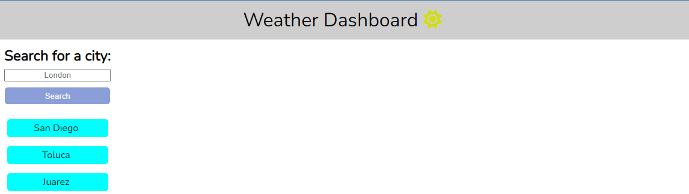

# Weather_Dashboard

## Description

This is the Weather Dashboard repository. The application was made with javascript and vanilla css. I also used the dayjs() library to display de current date. Here I applied mainly the knowledged I got from fetch and the promises, also I learned how arguments and parameters work in a function and how they can be called in another scope.

## Usage 

As a tourist you want to check the current weather of a city you are visiting. 

https://jonathanc0bosr.github.io/Weather_Dashboard/

## Licence

This repository was licenced under the MIT licence

